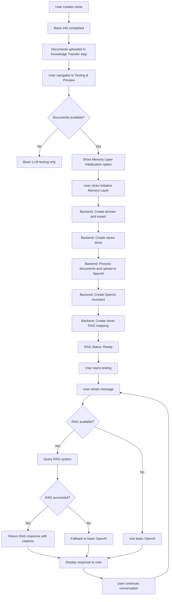
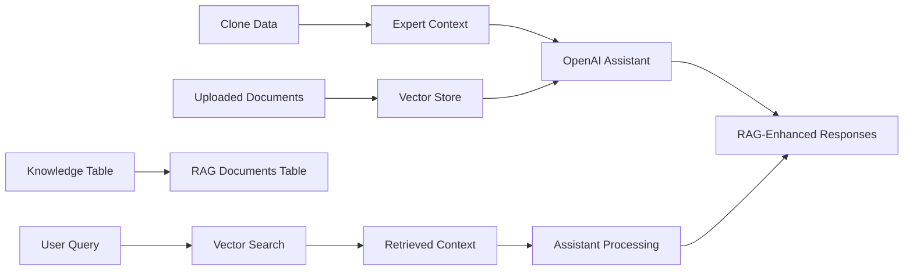
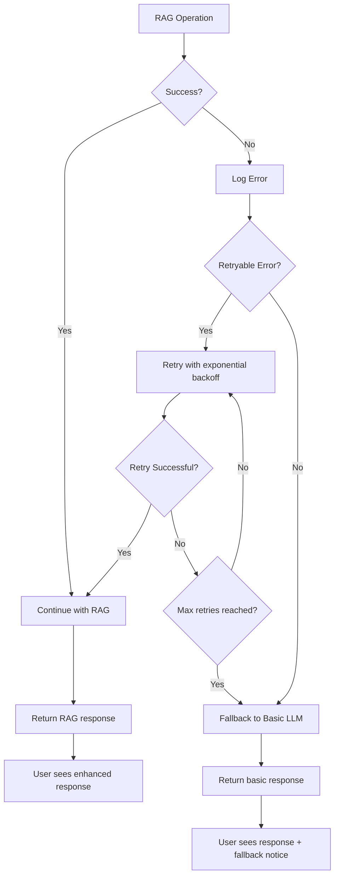

# Comprehensive RAG Integration Plan for CloneAI

## Executive Summary

This document provides a detailed, actionable integration plan for incorporating the RAG (Retrieval Augmented Generation) system into the CloneAI application. The integration will enhance the Testing & Preview workflow with intelligent memory layer capabilities while preserving existing functionality.

## Table of Contents

1. [Integration Overview](#integration-overview)
2. [Database Integration Plan](#database-integration-plan)
3. [API Integration Plan](#api-integration-plan)
4. [Frontend Integration Plan](#frontend-integration-plan)
5. [Data Flow Design](#data-flow-design)
6. [Error Handling Strategy](#error-handling-strategy)
7. [Performance Considerations](#performance-considerations)
8. [Implementation Phases](#implementation-phases)
9. [Testing Strategy](#testing-strategy)
10. [Deployment Checklist](#deployment-checklist)

## Integration Overview

### Current State Analysis

**Existing CloneAI Architecture:**
- Next.js frontend with TypeScript
- FastAPI backend with Supabase integration
- Testing & Preview in wizard step 6
- Basic OpenAI integration for clone testing
- Document upload and knowledge management

**RAG System Components:**
- Standalone FastAPI service (port 8000)
- PostgreSQL with 5 specialized tables
- OpenAI Assistant API integration
- LlamaParse document processing
- Vector store management

### Target Integration Architecture

The integration will create a hybrid approach:
1. **Primary RAG Mode**: When documents are uploaded and processed
2. **Fallback LLM Mode**: When no documents or RAG fails
3. **Enhanced Mode**: RAG response + personality tuning

## Database Integration Plan

### Strategy: Coexistence Approach

Instead of replacing existing tables, we'll add RAG tables alongside current schema and create bridging logic.

#### 1. RAG Tables Addition

**Execute in Supabase SQL Editor:**

```sql
-- Create Domain table with TEXT domain_name instead of enum
CREATE TABLE IF NOT EXISTS domains (
    id UUID PRIMARY KEY DEFAULT gen_random_uuid(),
    domain_name TEXT NOT NULL UNIQUE,
    expert_names TEXT[] DEFAULT '{}'::TEXT[]
);

-- Create Expert table
CREATE TABLE IF NOT EXISTS experts (
    id UUID PRIMARY KEY DEFAULT gen_random_uuid(),
    name TEXT NOT NULL,
    domain TEXT NOT NULL,
    context TEXT NOT NULL,
    CONSTRAINT fk_domain
        FOREIGN KEY (domain)
        REFERENCES domains (domain_name)
        ON DELETE CASCADE
);

-- Create Documents table (RAG-specific)
CREATE TABLE IF NOT EXISTS rag_documents (
    id UUID PRIMARY KEY DEFAULT gen_random_uuid(),
    name TEXT NOT NULL UNIQUE,
    document_link TEXT NOT NULL,
    created_by TEXT,
    domain TEXT NOT NULL,
    included_in_default BOOLEAN NOT NULL DEFAULT FALSE,
    client_name TEXT,
    openai_file_id TEXT,
    clone_id UUID REFERENCES clones(id) ON DELETE CASCADE,
    CONSTRAINT fk_domain
        FOREIGN KEY (domain)
        REFERENCES domains (domain_name)
        ON DELETE CASCADE
);

-- Create Vector Stores table
CREATE TABLE IF NOT EXISTS vector_stores (
    id UUID PRIMARY KEY DEFAULT gen_random_uuid(),
    vector_id TEXT NOT NULL UNIQUE,
    domain_name TEXT NOT NULL,
    expert_name TEXT,
    client_name TEXT,
    clone_id UUID REFERENCES clones(id) ON DELETE CASCADE,
    file_ids TEXT[] DEFAULT '{}'::TEXT[],
    batch_ids TEXT[] DEFAULT '{}'::TEXT[],
    latest_batch_id TEXT,
    owner TEXT NOT NULL,  -- 'domain', 'expert', or 'client'
    created_at TIMESTAMP WITH TIME ZONE DEFAULT NOW(),
    updated_at TIMESTAMP WITH TIME ZONE DEFAULT NOW(),
    CONSTRAINT fk_domain
        FOREIGN KEY (domain_name)
        REFERENCES domains (domain_name)
        ON DELETE CASCADE
);

-- Create Assistants table
CREATE TABLE IF NOT EXISTS assistants (
    id UUID PRIMARY KEY DEFAULT gen_random_uuid(),
    assistant_id TEXT NOT NULL UNIQUE,
    expert_name TEXT NOT NULL,
    memory_type TEXT NOT NULL,
    client_name TEXT,
    clone_id UUID REFERENCES clones(id) ON DELETE CASCADE,
    vector_id TEXT,
    created_at TIMESTAMP WITH TIME ZONE DEFAULT NOW(),
    updated_at TIMESTAMP WITH TIME ZONE DEFAULT NOW(),
    CONSTRAINT fk_expert
        FOREIGN KEY (expert_name)
        REFERENCES experts (name)
        ON DELETE CASCADE
);

-- Insert default domain values
INSERT INTO domains (domain_name) VALUES
    ('AI education'),
    ('High School counseling'),
    ('Medical pediatrics'),
    ('Business consulting'),
    ('Life coaching'),
    ('Legal advice'),
    ('Technical support'),
    ('General knowledge')
ON CONFLICT (domain_name) DO NOTHING;

-- Add storage bucket for documents (if not exists)
-- Note: This should be created via Supabase dashboard Storage section
```

#### 2. Bridge Table for Integration

```sql
-- Bridge table to connect existing clones with RAG components
CREATE TABLE IF NOT EXISTS clone_rag_mapping (
    id UUID PRIMARY KEY DEFAULT gen_random_uuid(),
    clone_id UUID NOT NULL REFERENCES clones(id) ON DELETE CASCADE,
    expert_name TEXT REFERENCES experts(name) ON DELETE CASCADE,
    domain_name TEXT REFERENCES domains(domain_name) ON DELETE CASCADE,
    assistant_id TEXT REFERENCES assistants(assistant_id) ON DELETE CASCADE,
    vector_store_id TEXT REFERENCES vector_stores(vector_id) ON DELETE CASCADE,
    rag_status TEXT DEFAULT 'pending', -- 'pending', 'initializing', 'ready', 'failed'
    created_at TIMESTAMP WITH TIME ZONE DEFAULT NOW(),
    updated_at TIMESTAMP WITH TIME ZONE DEFAULT NOW(),
    UNIQUE(clone_id)
);
```

#### 3. Update Database Types

**Add to `/types/database.ts`:**

```typescript
// Add RAG table types
domains: {
  Row: {
    id: string
    domain_name: string
    expert_names: string[] | null
  }
  Insert: {
    id?: string
    domain_name: string
    expert_names?: string[] | null
  }
  Update: {
    id?: string
    domain_name?: string
    expert_names?: string[] | null
  }
}

experts: {
  Row: {
    id: string
    name: string
    domain: string
    context: string
  }
  Insert: {
    id?: string
    name: string
    domain: string
    context: string
  }
  Update: {
    id?: string
    name?: string
    domain?: string
    context?: string
  }
}

rag_documents: {
  Row: {
    id: string
    name: string
    document_link: string
    created_by: string | null
    domain: string
    included_in_default: boolean
    client_name: string | null
    openai_file_id: string | null
    clone_id: string | null
  }
  Insert: {
    id?: string
    name: string
    document_link: string
    created_by?: string | null
    domain: string
    included_in_default?: boolean
    client_name?: string | null
    openai_file_id?: string | null
    clone_id?: string | null
  }
  Update: {
    id?: string
    name?: string
    document_link?: string
    created_by?: string | null
    domain?: string
    included_in_default?: boolean
    client_name?: string | null
    openai_file_id?: string | null
    clone_id?: string | null
  }
}

vector_stores: {
  Row: {
    id: string
    vector_id: string
    domain_name: string
    expert_name: string | null
    client_name: string | null
    clone_id: string | null
    file_ids: string[] | null
    batch_ids: string[] | null
    latest_batch_id: string | null
    owner: string
    created_at: string | null
    updated_at: string | null
  }
  Insert: {
    id?: string
    vector_id: string
    domain_name: string
    expert_name?: string | null
    client_name?: string | null
    clone_id?: string | null
    file_ids?: string[] | null
    batch_ids?: string[] | null
    latest_batch_id?: string | null
    owner: string
    created_at?: string | null
    updated_at?: string | null
  }
  Update: {
    id?: string
    vector_id?: string
    domain_name?: string
    expert_name?: string | null
    client_name?: string | null
    clone_id?: string | null
    file_ids?: string[] | null
    batch_ids?: string[] | null
    latest_batch_id?: string | null
    owner?: string
    created_at?: string | null
    updated_at?: string | null
  }
}

assistants: {
  Row: {
    id: string
    assistant_id: string
    expert_name: string
    memory_type: string
    client_name: string | null
    clone_id: string | null
    vector_id: string | null
    created_at: string | null
    updated_at: string | null
  }
  Insert: {
    id?: string
    assistant_id: string
    expert_name: string
    memory_type: string
    client_name?: string | null
    clone_id?: string | null
    vector_id?: string | null
    created_at?: string | null
    updated_at?: string | null
  }
  Update: {
    id?: string
    assistant_id?: string
    expert_name?: string
    memory_type?: string
    client_name?: string | null
    clone_id?: string | null
    vector_id?: string | null
    created_at?: string | null
    updated_at?: string | null
  }
}

clone_rag_mapping: {
  Row: {
    id: string
    clone_id: string
    expert_name: string
    domain_name: string
    assistant_id: string
    vector_store_id: string
    rag_status: string
    created_at: string | null
    updated_at: string | null
  }
  Insert: {
    id?: string
    clone_id: string
    expert_name: string
    domain_name: string
    assistant_id: string
    vector_store_id: string
    rag_status?: string
    created_at?: string | null
    updated_at?: string | null
  }
  Update: {
    id?: string
    clone_id?: string
    expert_name?: string
    domain_name?: string
    assistant_id?: string
    vector_store_id?: string
    rag_status?: string
    created_at?: string | null
    updated_at?: string | null
  }
}
```

## API Integration Plan

### Strategy: Integrated Backend Services

Instead of calling external RAG service, integrate RAG functionality directly into the CloneAI backend.

#### 1. Create RAG Service Module

**Create `/backend/app/services/rag_service.py`:**

```python
"""
RAG Service Integration for CloneAI
Implements the core RAG functionality using OpenAI Assistant API
"""
import os
import asyncio
from typing import List, Dict, Any, Optional
import structlog
from openai import AsyncOpenAI
from supabase import create_client

from app.database import get_service_supabase
from app.config import settings

logger = structlog.get_logger()

class RAGService:
    def __init__(self):
        self.openai_client = AsyncOpenAI(api_key=settings.OPENAI_API_KEY)
        self.supabase = get_service_supabase()
    
    async def initialize_expert_memory(
        self, 
        clone_id: str, 
        expert_name: str, 
        domain_name: str, 
        context: str,
        documents: List[Dict[str, Any]] = None,
        qa_pairs: List[Dict[str, str]] = None
    ) -> Dict[str, Any]:
        """
        Initialize RAG memory for a clone expert
        This implements the /memory/expert/initialize endpoint functionality
        """
        try:
            logger.info(f"Initializing RAG memory for clone {clone_id}, expert {expert_name}")
            
            # 1. Create or verify domain exists
            domain_result = await self._ensure_domain_exists(domain_name)
            if not domain_result['success']:
                return {'success': False, 'error': f"Failed to create domain: {domain_result['error']}"}
            
            # 2. Create or update expert
            expert_result = await self._create_or_update_expert(expert_name, domain_name, context)
            if not expert_result['success']:
                return {'success': False, 'error': f"Failed to create expert: {expert_result['error']}"}
            
            # 3. Create vector store for expert
            vector_store_result = await self._create_expert_vector_store(expert_name, domain_name, clone_id)
            if not vector_store_result['success']:
                return {'success': False, 'error': f"Failed to create vector store: {vector_store_result['error']}"}
            
            vector_store_id = vector_store_result['vector_id']
            
            # 4. Process and upload documents if provided
            if documents:
                doc_result = await self._process_documents(documents, vector_store_id, domain_name, clone_id)
                if not doc_result['success']:
                    logger.warning(f"Document processing had issues: {doc_result['error']}")
            
            # 5. Create OpenAI Assistant
            assistant_result = await self._create_assistant(expert_name, context, vector_store_id, clone_id)
            if not assistant_result['success']:
                return {'success': False, 'error': f"Failed to create assistant: {assistant_result['error']}"}
            
            assistant_id = assistant_result['assistant_id']
            
            # 6. Create mapping record
            mapping_result = await self._create_clone_rag_mapping(
                clone_id, expert_name, domain_name, assistant_id, vector_store_id
            )
            
            return {
                'success': True,
                'message': f"Successfully initialized memory for expert {expert_name}",
                'data': {
                    'expert_name': expert_name,
                    'domain_name': domain_name,
                    'vector_store_id': vector_store_id,
                    'assistant_id': assistant_id,
                    'clone_id': clone_id
                }
            }
            
        except Exception as e:
            logger.error(f"Failed to initialize expert memory: {str(e)}")
            return {'success': False, 'error': str(e)}
    
    async def query_expert_with_assistant(
        self, 
        clone_id: str, 
        query: str,
        conversation_history: List[Dict[str, str]] = None
    ) -> Dict[str, Any]:
        """
        Query expert using OpenAI Assistant API with RAG
        This implements the /query_expert_with_assistant endpoint functionality
        """
        try:
            logger.info(f"Querying expert for clone {clone_id} with query: {query[:100]}...")
            
            # 1. Get RAG mapping for clone
            mapping = await self._get_clone_rag_mapping(clone_id)
            if not mapping:
                return {'success': False, 'error': 'RAG memory not initialized for this clone'}
            
            if mapping['rag_status'] != 'ready':
                return {'success': False, 'error': f"RAG memory status: {mapping['rag_status']}"}
            
            # 2. Create thread for conversation
            thread = await self.openai_client.beta.threads.create()
            
            # 3. Add conversation history if provided
            if conversation_history:
                for msg in conversation_history[-5:]:  # Last 5 messages for context
                    await self.openai_client.beta.threads.messages.create(
                        thread_id=thread.id,
                        role=msg.get('role', 'user'),
                        content=msg.get('content', '')
                    )
            
            # 4. Add current query
            await self.openai_client.beta.threads.messages.create(
                thread_id=thread.id,
                role="user",
                content=query
            )
            
            # 5. Run assistant
            run = await self.openai_client.beta.threads.runs.create_and_poll(
                thread_id=thread.id,
                assistant_id=mapping['assistant_id']
            )
            
            if run.status == 'completed':
                # 6. Get response
                messages = await self.openai_client.beta.threads.messages.list(
                    thread_id=thread.id
                )
                
                latest_message = messages.data[0]
                response_content = latest_message.content[0].text.value
                
                # 7. Extract citations if available
                citations = self._extract_citations(latest_message)
                
                return {
                    'success': True,
                    'response': response_content,
                    'citations': citations,
                    'metadata': {
                        'expert_name': mapping['expert_name'],
                        'run_id': run.id,
                        'thread_id': thread.id
                    }
                }
            else:
                return {'success': False, 'error': f'Assistant run failed with status: {run.status}'}
                
        except Exception as e:
            logger.error(f"Failed to query expert: {str(e)}")
            return {'success': False, 'error': str(e)}
    
    async def update_expert_knowledge(
        self, 
        clone_id: str, 
        documents: List[Dict[str, Any]] = None,
        operation: str = "append"  # "append", "replace"
    ) -> Dict[str, Any]:
        """
        Update expert knowledge base with new documents
        This implements the /expert/update endpoint functionality
        """
        try:
            logger.info(f"Updating expert knowledge for clone {clone_id}")
            
            # 1. Get RAG mapping
            mapping = await self._get_clone_rag_mapping(clone_id)
            if not mapping:
                return {'success': False, 'error': 'RAG memory not initialized for this clone'}
            
            vector_store_id = mapping['vector_store_id']
            
            # 2. Process documents based on operation
            if operation == "replace":
                # Clear existing documents
                await self._clear_vector_store(vector_store_id)
            
            # 3. Add new documents
            if documents:
                doc_result = await self._process_documents(
                    documents, vector_store_id, mapping['domain_name'], clone_id
                )
                if not doc_result['success']:
                    return {'success': False, 'error': f"Failed to process documents: {doc_result['error']}"}
            
            # 4. Update mapping status
            await self._update_rag_mapping_status(clone_id, 'ready')
            
            return {
                'success': True,
                'message': f"Successfully updated expert knowledge for clone {clone_id}",
                'operation': operation,
                'documents_processed': len(documents) if documents else 0
            }
            
        except Exception as e:
            logger.error(f"Failed to update expert knowledge: {str(e)}")
            return {'success': False, 'error': str(e)}
    
    # Helper methods
    async def _ensure_domain_exists(self, domain_name: str) -> Dict[str, Any]:
        """Ensure domain exists in database"""
        try:
            # Check if domain exists
            result = self.supabase.table('domains').select('*').eq('domain_name', domain_name).execute()
            
            if not result.data:
                # Create domain
                insert_result = self.supabase.table('domains').insert({
                    'domain_name': domain_name,
                    'expert_names': []
                }).execute()
                
                if insert_result.data:
                    return {'success': True, 'domain_id': insert_result.data[0]['id']}
                else:
                    return {'success': False, 'error': 'Failed to create domain'}
            
            return {'success': True, 'domain_id': result.data[0]['id']}
            
        except Exception as e:
            return {'success': False, 'error': str(e)}
    
    async def _create_or_update_expert(self, expert_name: str, domain_name: str, context: str) -> Dict[str, Any]:
        """Create or update expert in database"""
        try:
            # Upsert expert
            result = self.supabase.table('experts').upsert({
                'name': expert_name,
                'domain': domain_name,
                'context': context
            }, on_conflict='name').execute()
            
            if result.data:
                return {'success': True, 'expert_id': result.data[0]['id']}
            else:
                return {'success': False, 'error': 'Failed to create/update expert'}
                
        except Exception as e:
            return {'success': False, 'error': str(e)}
    
    async def _create_expert_vector_store(self, expert_name: str, domain_name: str, clone_id: str) -> Dict[str, Any]:
        """Create OpenAI vector store for expert"""
        try:
            # Create vector store
            vector_store = await self.openai_client.beta.vector_stores.create(
                name=f"{expert_name}_{domain_name}_{clone_id}"
            )
            
            # Store in database
            result = self.supabase.table('vector_stores').insert({
                'vector_id': vector_store.id,
                'domain_name': domain_name,
                'expert_name': expert_name,
                'clone_id': clone_id,
                'owner': 'expert',
                'file_ids': [],
                'batch_ids': []
            }).execute()
            
            if result.data:
                return {'success': True, 'vector_id': vector_store.id}
            else:
                return {'success': False, 'error': 'Failed to store vector store info'}
                
        except Exception as e:
            return {'success': False, 'error': str(e)}
    
    async def _process_documents(self, documents: List[Dict[str, Any]], vector_store_id: str, domain_name: str, clone_id: str) -> Dict[str, Any]:
        """Process and upload documents to vector store"""
        try:
            file_ids = []
            
            for doc in documents:
                if 'file_url' in doc:
                    # Download and upload file
                    file_id = await self._upload_file_to_openai(doc['file_url'], doc.get('name', 'document'))
                    if file_id:
                        file_ids.append(file_id)
                        
                        # Store document record
                        self.supabase.table('rag_documents').insert({
                            'name': doc.get('name', 'document'),
                            'document_link': doc['file_url'],
                            'domain': domain_name,
                            'clone_id': clone_id,
                            'openai_file_id': file_id,
                            'client_name': clone_id  # Use clone_id as client name
                        }).execute()
            
            if file_ids:
                # Add files to vector store
                await self.openai_client.beta.vector_stores.file_batches.create_and_poll(
                    vector_store_id=vector_store_id,
                    file_ids=file_ids
                )
                
                # Update vector store record
                self.supabase.table('vector_stores').update({
                    'file_ids': file_ids
                }).eq('vector_id', vector_store_id).execute()
            
            return {'success': True, 'files_processed': len(file_ids)}
            
        except Exception as e:
            return {'success': False, 'error': str(e)}
    
    async def _upload_file_to_openai(self, file_url: str, file_name: str) -> Optional[str]:
        """Upload file to OpenAI for vector store"""
        try:
            # For now, assume files are accessible URLs
            # In production, you'd download the file first
            import requests
            response = requests.get(file_url)
            if response.status_code == 200:
                file_obj = await self.openai_client.files.create(
                    file=response.content,
                    purpose="assistants"
                )
                return file_obj.id
            return None
        except Exception as e:
            logger.error(f"Failed to upload file {file_name}: {str(e)}")
            return None
    
    async def _create_assistant(self, expert_name: str, context: str, vector_store_id: str, clone_id: str) -> Dict[str, Any]:
        """Create OpenAI Assistant"""
        try:
            assistant = await self.openai_client.beta.assistants.create(
                model="gpt-4o",
                name=f"{expert_name} Assistant",
                instructions=context,
                tools=[{"type": "file_search"}],
                tool_resources={
                    "file_search": {
                        "vector_store_ids": [vector_store_id]
                    }
                }
            )
            
            # Store assistant record
            result = self.supabase.table('assistants').insert({
                'assistant_id': assistant.id,
                'expert_name': expert_name,
                'memory_type': 'expert',
                'clone_id': clone_id,
                'vector_id': vector_store_id
            }).execute()
            
            if result.data:
                return {'success': True, 'assistant_id': assistant.id}
            else:
                return {'success': False, 'error': 'Failed to store assistant info'}
                
        except Exception as e:
            return {'success': False, 'error': str(e)}
    
    async def _create_clone_rag_mapping(self, clone_id: str, expert_name: str, domain_name: str, assistant_id: str, vector_store_id: str) -> Dict[str, Any]:
        """Create clone RAG mapping record"""
        try:
            result = self.supabase.table('clone_rag_mapping').upsert({
                'clone_id': clone_id,
                'expert_name': expert_name,
                'domain_name': domain_name,
                'assistant_id': assistant_id,
                'vector_store_id': vector_store_id,
                'rag_status': 'ready'
            }, on_conflict='clone_id').execute()
            
            return {'success': True, 'mapping_id': result.data[0]['id']}
            
        except Exception as e:
            return {'success': False, 'error': str(e)}
    
    async def _get_clone_rag_mapping(self, clone_id: str) -> Optional[Dict[str, Any]]:
        """Get RAG mapping for clone"""
        try:
            result = self.supabase.table('clone_rag_mapping').select('*').eq('clone_id', clone_id).execute()
            return result.data[0] if result.data else None
        except Exception:
            return None
    
    async def _update_rag_mapping_status(self, clone_id: str, status: str) -> bool:
        """Update RAG mapping status"""
        try:
            self.supabase.table('clone_rag_mapping').update({
                'rag_status': status,
                'updated_at': 'now()'
            }).eq('clone_id', clone_id).execute()
            return True
        except Exception:
            return False
    
    async def _extract_citations(self, message) -> List[Dict[str, str]]:
        """Extract citations from OpenAI Assistant response"""
        citations = []
        
        # Check for file citations in the message
        if hasattr(message, 'content') and message.content:
            for content_block in message.content:
                if hasattr(content_block, 'text') and hasattr(content_block.text, 'annotations'):
                    for annotation in content_block.text.annotations:
                        if hasattr(annotation, 'file_citation'):
                            citations.append({
                                'file_id': annotation.file_citation.file_id,
                                'quote': annotation.text
                            })
        
        return citations
    
    async def _clear_vector_store(self, vector_store_id: str) -> bool:
        """Clear all files from vector store"""
        try:
            # List all files in vector store
            files = await self.openai_client.beta.vector_stores.files.list(
                vector_store_id=vector_store_id
            )
            
            # Delete all files
            for file in files.data:
                await self.openai_client.beta.vector_stores.files.delete(
                    vector_store_id=vector_store_id,
                    file_id=file.id
                )
            
            return True
        except Exception:
            return False

# Global instance
rag_service = RAGService()
```

#### 2. Update Backend API Endpoints

**Modify `/backend/app/api/clones.py`** to add RAG endpoints:

```python
# Add to imports
from app.services.rag_service import rag_service

# Add RAG initialization endpoint
@router.post("/{clone_id}/initialize-rag")
async def initialize_clone_rag(
    clone_id: str,
    current_user_id: str = Depends(get_current_user_id),
    supabase_client = Depends(get_supabase)
):
    """
    Initialize RAG memory for a clone
    """
    try:
        # Get clone data
        clone_result = supabase_client.table("clones").select("*").eq("id", clone_id).eq("creator_id", current_user_id).execute()
        
        if not clone_result.data:
            raise HTTPException(status_code=404, detail="Clone not found")
        
        clone = clone_result.data[0]
        
        # Get documents for this clone
        docs_result = supabase_client.table("knowledge").select("*").eq("clone_id", clone_id).execute()
        documents = []
        
        for doc in docs_result.data:
            documents.append({
                'name': doc['title'],
                'file_url': doc['file_url'],
                'content_type': doc['content_type']
            })
        
        # Prepare expert context
        expert_name = clone['name']
        domain_name = clone['category'] or 'general'
        context = f"""You are {expert_name}, a professional {clone.get('professional_title', 'expert')}.

Bio: {clone.get('bio', '')}

Expertise Areas: {', '.join(clone.get('expertise_areas', []))}

System Prompt: {clone.get('system_prompt', '')}

Communication Style: {clone.get('communication_style', {})}

Personality Traits: {clone.get('personality_traits', {})}

You should respond as {expert_name} would, using your expertise and the provided knowledge base to give helpful, professional advice."""
        
        # Initialize RAG
        result = await rag_service.initialize_expert_memory(
            clone_id=clone_id,
            expert_name=expert_name,
            domain_name=domain_name,
            context=context,
            documents=documents
        )
        
        if result['success']:
            return {"status": "success", "message": result['message'], "data": result['data']}
        else:
            raise HTTPException(status_code=500, detail=result['error'])
            
    except Exception as e:
        logger.error(f"Failed to initialize RAG for clone {clone_id}: {str(e)}")
        raise HTTPException(status_code=500, detail=str(e))

# Add RAG query endpoint  
@router.post("/{clone_id}/query-rag")
async def query_clone_rag(
    clone_id: str,
    query_data: dict,
    current_user_id: str = Depends(get_current_user_id),
    supabase_client = Depends(get_supabase)
):
    """
    Query clone using RAG
    """
    try:
        # Verify clone access
        clone_result = supabase_client.table("clones").select("*").eq("id", clone_id).execute()
        
        if not clone_result.data:
            raise HTTPException(status_code=404, detail="Clone not found")
        
        query = query_data.get('query', '')
        conversation_history = query_data.get('history', [])
        
        # Query RAG
        result = await rag_service.query_expert_with_assistant(
            clone_id=clone_id,
            query=query,
            conversation_history=conversation_history
        )
        
        if result['success']:
            return {
                "response": result['response'],
                "citations": result.get('citations', []),
                "metadata": result.get('metadata', {})
            }
        else:
            # Fallback to basic OpenAI if RAG fails
            logger.warning(f"RAG failed for clone {clone_id}, falling back to basic LLM: {result['error']}")
            
            # Get clone for fallback
            clone = clone_result.data[0]
            fallback_response = await _fallback_openai_query(clone, query, conversation_history)
            
            return {
                "response": fallback_response,
                "citations": [],
                "metadata": {"fallback": True, "error": result['error']}
            }
            
    except Exception as e:
        logger.error(f"Failed to query RAG for clone {clone_id}: {str(e)}")
        raise HTTPException(status_code=500, detail=str(e))

# Add RAG update endpoint
@router.post("/{clone_id}/update-rag")
async def update_clone_rag(
    clone_id: str,
    update_data: dict,
    current_user_id: str = Depends(get_current_user_id),
    supabase_client = Depends(get_supabase)
):
    """
    Update RAG knowledge for clone
    """
    try:
        # Verify clone access
        clone_result = supabase_client.table("clones").select("*").eq("id", clone_id).eq("creator_id", current_user_id).execute()
        
        if not clone_result.data:
            raise HTTPException(status_code=404, detail="Clone not found")
        
        documents = update_data.get('documents', [])
        operation = update_data.get('operation', 'append')
        
        # Update RAG
        result = await rag_service.update_expert_knowledge(
            clone_id=clone_id,
            documents=documents,
            operation=operation
        )
        
        if result['success']:
            return {"status": "success", "message": result['message']}
        else:
            raise HTTPException(status_code=500, detail=result['error'])
            
    except Exception as e:
        logger.error(f"Failed to update RAG for clone {clone_id}: {str(e)}")
        raise HTTPException(status_code=500, detail=str(e))

async def _fallback_openai_query(clone: dict, query: str, conversation_history: List[dict]) -> str:
    """Fallback to basic OpenAI when RAG fails"""
    from app.services.openai_service import openai_service
    
    # Build context from clone data
    context = f"""You are {clone['name']}, a professional {clone.get('professional_title', 'expert')}.

Bio: {clone.get('bio', '')}

Expertise Areas: {', '.join(clone.get('expertise_areas', []))}

System Prompt: {clone.get('system_prompt', '')}

Respond as {clone['name']} would, providing helpful professional advice within your expertise."""
    
    messages = [{"role": "system", "content": context}]
    
    # Add conversation history
    for msg in conversation_history[-5:]:  # Last 5 messages
        messages.append({
            "role": msg.get('role', 'user'),
            "content": msg.get('content', '')
        })
    
    # Add current query
    messages.append({"role": "user", "content": query})
    
    # Get response from OpenAI
    response = await openai_service.chat_completion(messages)
    return response.get('content', 'I apologize, but I cannot process your request right now.')
```

## Frontend Integration Plan

### Strategy: Enhanced Testing & Preview

Modify the existing Testing & Preview step (step 6) to integrate RAG capabilities while maintaining backward compatibility.

#### 1. Update Wizard Testing Step

**Modify `/app/create-clone/wizard/page.tsx`:**

```typescript
// Add new state for RAG functionality
const [ragStatus, setRagStatus] = useState<'not_initialized' | 'initializing' | 'ready' | 'failed'>('not_initialized')
const [ragError, setRagError] = useState<string | null>(null)
const [isInitializingRAG, setIsInitializingRAG] = useState(false)

// Add RAG initialization function
const initializeRAGMemory = async (cloneId: string) => {
  try {
    setIsInitializingRAG(true)
    setRagStatus('initializing')
    
    const supabase = createClient()
    const { data: { session }, error: sessionError } = await supabase.auth.getSession()
    
    if (sessionError || !session) {
      throw new Error('Authentication session expired. Please refresh the page and try again.')
    }

    const response = await fetch(`/api/clones/${cloneId}/initialize-rag`, {
      method: 'POST',
      headers: {
        'Content-Type': 'application/json',
        'Authorization': `Bearer ${session.access_token}`,
      },
    })

    if (!response.ok) {
      const errorData = await response.json()
      throw new Error(errorData.detail || 'Failed to initialize RAG memory')
    }

    const result = await response.json()
    setRagStatus('ready')
    
    toast({
      title: "🧠 Memory Layer Ready!",
      description: "Your clone's knowledge base has been prepared for intelligent conversations.",
    })
    
    return result
  } catch (error) {
    console.error('Failed to initialize RAG:', error)
    setRagStatus('failed')
    setRagError(error instanceof Error ? error.message : 'Unknown error')
    
    toast({
      title: "Memory Layer Failed",
      description: "Falling back to basic mode. You can retry initialization later.",
      variant: "destructive",
    })
  } finally {
    setIsInitializingRAG(false)
  }
}

// Update the testCloneWithAI function
const testCloneWithAI = async (userMessage: string) => {
  try {
    const supabase = createClient()
    
    // Try RAG first if available
    if (createdCloneId && ragStatus === 'ready') {
      console.log('Using RAG-powered testing for clone:', createdCloneId)
      
      const { data: { session }, error: sessionError } = await supabase.auth.getSession()
      
      if (sessionError || !session) {
        throw new Error('Authentication session expired. Please refresh the page and try again.')
      }

      const response = await fetch(`/api/clones/${createdCloneId}/query-rag`, {
        method: 'POST',
        headers: {
          'Content-Type': 'application/json',
          'Authorization': `Bearer ${session.access_token}`,
        },
        body: JSON.stringify({
          query: userMessage,
          history: testMessages.slice(-5).map(msg => ({
            role: msg.sender === 'user' ? 'user' : 'assistant',
            content: msg.content
          }))
        }),
      })

      if (response.ok) {
        const result = await response.json()
        
        // Add citation info if available
        let responseText = result.response
        if (result.citations && result.citations.length > 0) {
          responseText += '\n\n📚 *Response based on your knowledge base*'
        }
        
        return responseText
      } else {
        console.warn('RAG query failed, falling back to basic OpenAI')
        // Fall through to basic OpenAI
      }
    }
    
    // Fallback to basic OpenAI (existing implementation)
    const systemPrompt = generateSystemPrompt()
    
    const messages = [
      { role: "system", content: systemPrompt },
      ...testMessages.slice(-5).map(msg => ({
        role: msg.sender === "user" ? "user" : "assistant",
        content: msg.content
      })),
      { role: "user", content: userMessage }
    ]

    const response = await fetch('/api/chat/test-clone', {
      method: 'POST',
      headers: {
        'Content-Type': 'application/json',
      },
      body: JSON.stringify({ messages }),
    })

    if (!response.ok) {
      throw new Error('Failed to get response from AI')
    }

    const data = await response.json()
    return data.response || "I'm having trouble processing that request right now."
    
  } catch (error) {
    console.error('Error in testCloneWithAI:', error)
    throw error
  }
}

// Update the testing step UI (case 6)
case 6:
  return (
    <div className="space-y-6">
      {/* RAG Status Cards */}
      <div className="grid grid-cols-1 md:grid-cols-3 gap-4">
        <Card className="text-center">
          <CardContent className="pt-6">
            <MessageCircle className="h-8 w-8 mx-auto text-blue-600 mb-2" />
            <h3 className="font-semibold text-sm">Chat Clone</h3>
            <p className="text-xs text-slate-600 dark:text-slate-300 mt-1">Text conversations</p>
            <div className="mt-2">
              <span className="text-xs px-2 py-1 bg-green-100 dark:bg-green-900/30 text-green-700 dark:text-green-300 rounded-full">
                Ready
              </span>
            </div>
          </CardContent>
        </Card>

        <Card className="text-center">
          <CardContent className="pt-6">
            <Cpu className="h-8 w-8 mx-auto text-purple-600 mb-2" />
            <h3 className="font-semibold text-sm">Memory Layer</h3>
            <p className="text-xs text-slate-600 dark:text-slate-300 mt-1">RAG-powered knowledge</p>
            <div className="mt-2">
              <span className={`text-xs px-2 py-1 rounded-full ${
                ragStatus === 'ready' ? 'bg-green-100 dark:bg-green-900/30 text-green-700 dark:text-green-300' :
                ragStatus === 'initializing' ? 'bg-yellow-100 dark:bg-yellow-900/30 text-yellow-700 dark:text-yellow-300' :
                ragStatus === 'failed' ? 'bg-red-100 dark:bg-red-900/30 text-red-700 dark:text-red-300' :
                'bg-slate-100 dark:bg-slate-800 text-slate-600 dark:text-slate-300'
              }`}>
                {ragStatus === 'ready' ? 'Ready' :
                 ragStatus === 'initializing' ? 'Preparing...' :
                 ragStatus === 'failed' ? 'Failed' :
                 'Not Initialized'}
              </span>
            </div>
          </CardContent>
        </Card>

        <Card className="text-center">
          <CardContent className="pt-6">
            <Video className="h-8 w-8 mx-auto text-slate-400 mb-2" />
            <h3 className="font-semibold text-sm">Video Clone</h3>
            <p className="text-xs text-slate-600 dark:text-slate-300 mt-1">Video conversations</p>
            <div className="mt-2">
              <span className="text-xs px-2 py-1 bg-slate-100 dark:bg-slate-800 text-slate-600 dark:text-slate-300 rounded-full">
                {formData.enableVideo ? "Ready" : "Not Enabled"}
              </span>
            </div>
          </CardContent>
        </Card>
      </div>

      {/* Memory Layer Initialization */}
      {ragStatus === 'not_initialized' && createdCloneId && (formData.documents.length > 0 || formData.links.length > 0) && (
        <Card className="border-purple-200 dark:border-purple-800">
          <CardHeader>
            <CardTitle className="flex items-center space-x-2 text-purple-700 dark:text-purple-300">
              <Cpu className="h-5 w-5" />
              <span>Prepare Memory Layer</span>
            </CardTitle>
            <p className="text-sm text-slate-600 dark:text-slate-300">
              Initialize your clone's intelligent memory system to enable RAG-powered conversations using your uploaded knowledge base.
            </p>
          </CardHeader>
          <CardContent>
            <div className="flex items-center justify-between p-4 bg-purple-50 dark:bg-purple-900/20 rounded-lg">
              <div className="flex items-center space-x-3">
                <div className="h-12 w-12 bg-purple-100 dark:bg-purple-900/40 rounded-full flex items-center justify-center">
                  <Cpu className="h-6 w-6 text-purple-600" />
                </div>
                <div>
                  <p className="font-medium text-purple-900 dark:text-purple-100">Memory Layer Available</p>
                  <p className="text-sm text-purple-700 dark:text-purple-300">
                    {formData.documents.length + formData.links.length} knowledge sources ready for processing
                  </p>
                </div>
              </div>
              <Button
                onClick={() => initializeRAGMemory(createdCloneId)}
                disabled={isInitializingRAG}
                className="bg-purple-600 hover:bg-purple-700"
              >
                {isInitializingRAG ? (
                  <>
                    <RefreshCw className="h-4 w-4 mr-2 animate-spin" />
                    Preparing Memory...
                  </>
                ) : (
                  <>
                    <Cpu className="h-4 w-4 mr-2" />
                    Initialize Memory Layer
                  </>
                )}
              </Button>
            </div>
          </CardContent>
        </Card>
      )}

      {/* Memory Layer Status */}
      {ragStatus === 'initializing' && (
        <Card className="border-yellow-200 dark:border-yellow-800">
          <CardContent className="pt-6">
            <div className="text-center">
              <div className="inline-flex items-center justify-center w-16 h-16 bg-yellow-100 dark:bg-yellow-900/30 rounded-full mb-4">
                <RefreshCw className="h-8 w-8 text-yellow-600 animate-spin" />
              </div>
              <h3 className="font-semibold text-yellow-900 dark:text-yellow-100 mb-2">Preparing Memory Layer</h3>
              <p className="text-sm text-yellow-700 dark:text-yellow-300">
                Processing your knowledge base and setting up intelligent retrieval system...
              </p>
            </div>
          </CardContent>
        </Card>
      )}

      {ragStatus === 'failed' && (
        <Card className="border-red-200 dark:border-red-800">
          <CardContent className="pt-6">
            <div className="text-center">
              <div className="inline-flex items-center justify-center w-16 h-16 bg-red-100 dark:bg-red-900/30 rounded-full mb-4">
                <X className="h-8 w-8 text-red-600" />
              </div>
              <h3 className="font-semibold text-red-900 dark:text-red-100 mb-2">Memory Layer Failed</h3>
              <p className="text-sm text-red-700 dark:text-red-300 mb-4">
                {ragError || 'Failed to initialize memory layer. Your clone will use basic mode.'}
              </p>
              <Button
                onClick={() => initializeRAGMemory(createdCloneId!)}
                disabled={isInitializingRAG}
                variant="outline"
                className="border-red-300 text-red-700 hover:bg-red-50"
              >
                <RefreshCw className="h-4 w-4 mr-2" />
                Retry Initialization
              </Button>
            </div>
          </CardContent>
        </Card>
      )}

      {/* Main Testing Interface */}
      <Card>
        <CardHeader>
          <CardTitle className="flex items-center space-x-2">
            <Play className="h-5 w-5" />
            <span>Clone Testing</span>
          </CardTitle>
          <p className="text-sm text-slate-600 dark:text-slate-300 mt-1">
            Test your AI clone with real conversations. {ragStatus === 'ready' ? 'Enhanced with your knowledge base via RAG.' : 'Using basic training mode.'}
          </p>
        </CardHeader>
        <CardContent>
          {isTestingClone ? (
            <div className="space-y-4">
              {/* Stop Testing Button */}
              <div className="flex justify-end">
                <Button
                  onClick={() => setIsTestingClone(false)}
                  variant="outline"
                  size="sm"
                >
                  Stop Testing
                </Button>
              </div>
              
              {/* Chat Interface - existing implementation */}
              {/* ... existing chat interface code ... */}
              
              {/* Enhanced Testing Info */}
              <div className="text-xs text-slate-500 dark:text-slate-400 bg-slate-100 dark:bg-slate-800 p-3 rounded-lg">
                <div className="flex items-center space-x-4 flex-wrap">
                  <span>💡 <strong>Mode:</strong> {
                    ragStatus === 'ready' ? 'RAG-enhanced with your knowledge base' :
                    ragStatus === 'initializing' ? 'Memory layer preparing...' :
                    ragStatus === 'failed' ? 'Basic mode (memory layer failed)' :
                    'Basic training mode'
                  }</span>
                  <span>🔒 <strong>Privacy:</strong> Test conversations are not saved</span>
                  {ragStatus === 'ready' && (
                    <span>📚 <strong>Knowledge:</strong> Enhanced with {formData.documents.length + formData.links.length} sources</span>
                  )}
                  {ragStatus === 'failed' && (
                    <div className="flex items-center justify-between w-full">
                      <span>⚠️ <strong>Fallback:</strong> Using basic LLM mode</span>
                      {createdCloneId && (
                        <Button
                          variant="outline"
                          size="sm"
                          onClick={() => initializeRAGMemory(createdCloneId)}
                          disabled={isInitializingRAG}
                          className="ml-4 flex-shrink-0"
                        >
                          <RefreshCw className="h-3 w-3 mr-1" />
                          Retry Memory
                        </Button>
                      )}
                    </div>
                  )}
                </div>
              </div>
            </div>
          ) : (
            <div className="text-center py-16">
              <div className="mx-auto w-20 h-20 bg-gradient-to-br from-blue-100 to-blue-200 dark:from-blue-900/30 dark:to-blue-800/30 rounded-full flex items-center justify-center mb-6">
                <Play className="h-10 w-10 text-blue-600 ml-1" />
              </div>
              <h3 className="text-xl font-semibold mb-3">Test Your AI Clone</h3>
              <p className="text-slate-600 dark:text-slate-300 mb-8 max-w-md mx-auto">
                Start a conversation to see how your AI clone responds. {ragStatus === 'ready' ? 'Enhanced with your knowledge base!' : 'Initialize memory layer for enhanced responses.'}
              </p>
              <div className="space-y-3">
                <Button 
                  onClick={() => setIsTestingClone(true)}
                  size="lg"
                  className="px-12 py-3 text-base"
                >
                  <Play className="h-5 w-5 mr-3" />
                  Start Testing
                </Button>
                
                {/* Memory initialization button if not done */}
                {ragStatus === 'not_initialized' && createdCloneId && (formData.documents.length > 0 || formData.links.length > 0) && (
                  <div className="mt-4">
                    <p className="text-sm text-slate-600 dark:text-slate-300 mb-2">
                      For enhanced responses, initialize the memory layer first
                    </p>
                    <Button
                      onClick={() => initializeRAGMemory(createdCloneId)}
                      disabled={isInitializingRAG}
                      variant="outline"
                      size="sm"
                    >
                      {isInitializingRAG ? (
                        <>
                          <RefreshCw className="h-4 w-4 mr-2 animate-spin" />
                          Preparing Memory Layer...
                        </>
                      ) : (
                        <>
                          <Cpu className="h-4 w-4 mr-2" />
                          Initialize Memory Layer
                        </>
                      )}
                    </Button>
                  </div>
                )}
              </div>
            </div>
          )}
        </CardContent>
      </Card>
    </div>
  )
```

#### 2. Add RAG Status Management Hook

**Create `/hooks/use-rag.ts`:**

```typescript
import { useState, useCallback } from 'react'
import { createClient } from '@/utils/supabase/client'
import { toast } from '@/components/ui/use-toast'

type RAGStatus = 'not_initialized' | 'initializing' | 'ready' | 'failed'

interface RAGState {
  status: RAGStatus
  error: string | null
  isInitializing: boolean
}

interface RAGHook {
  ragState: RAGState
  initializeRAG: (cloneId: string) => Promise<void>
  queryRAG: (cloneId: string, query: string, history?: any[]) => Promise<string>
  updateRAG: (cloneId: string, documents: any[], operation?: 'append' | 'replace') => Promise<void>
  resetRAGState: () => void
}

export const useRAG = (): RAGHook => {
  const [ragState, setRAGState] = useState<RAGState>({
    status: 'not_initialized',
    error: null,
    isInitializing: false
  })

  const resetRAGState = useCallback(() => {
    setRAGState({
      status: 'not_initialized',
      error: null,
      isInitializing: false
    })
  }, [])

  const initializeRAG = useCallback(async (cloneId: string) => {
    try {
      setRAGState(prev => ({ ...prev, isInitializing: true, status: 'initializing', error: null }))
      
      const supabase = createClient()
      const { data: { session }, error: sessionError } = await supabase.auth.getSession()
      
      if (sessionError || !session) {
        throw new Error('Authentication session expired. Please refresh the page and try again.')
      }

      const response = await fetch(`/api/clones/${cloneId}/initialize-rag`, {
        method: 'POST',
        headers: {
          'Content-Type': 'application/json',
          'Authorization': `Bearer ${session.access_token}`,
        },
      })

      if (!response.ok) {
        const errorData = await response.json()
        throw new Error(errorData.detail || 'Failed to initialize RAG memory')
      }

      const result = await response.json()
      
      setRAGState(prev => ({ ...prev, status: 'ready', error: null }))
      
      toast({
        title: "🧠 Memory Layer Ready!",
        description: "Your clone's knowledge base has been prepared for intelligent conversations.",
      })
      
    } catch (error) {
      const errorMessage = error instanceof Error ? error.message : 'Unknown error'
      
      setRAGState(prev => ({ 
        ...prev, 
        status: 'failed', 
        error: errorMessage 
      }))
      
      toast({
        title: "Memory Layer Failed",
        description: "Falling back to basic mode. You can retry initialization later.",
        variant: "destructive",
      })
    } finally {
      setRAGState(prev => ({ ...prev, isInitializing: false }))
    }
  }, [])

  const queryRAG = useCallback(async (cloneId: string, query: string, history: any[] = []): Promise<string> => {
    try {
      const supabase = createClient()
      const { data: { session }, error: sessionError } = await supabase.auth.getSession()
      
      if (sessionError || !session) {
        throw new Error('Authentication session expired')
      }

      const response = await fetch(`/api/clones/${cloneId}/query-rag`, {
        method: 'POST',
        headers: {
          'Content-Type': 'application/json',
          'Authorization': `Bearer ${session.access_token}`,
        },
        body: JSON.stringify({
          query,
          history: history.slice(-5) // Last 5 messages for context
        }),
      })

      if (!response.ok) {
        throw new Error('RAG query failed')
      }

      const result = await response.json()
      
      // Add citation info if available
      let responseText = result.response
      if (result.citations && result.citations.length > 0) {
        responseText += '\n\n📚 *Response based on your knowledge base*'
      }
      
      return responseText
      
    } catch (error) {
      console.error('RAG query failed:', error)
      throw error
    }
  }, [])

  const updateRAG = useCallback(async (cloneId: string, documents: any[], operation: 'append' | 'replace' = 'append') => {
    try {
      const supabase = createClient()
      const { data: { session }, error: sessionError } = await supabase.auth.getSession()
      
      if (sessionError || !session) {
        throw new Error('Authentication session expired')
      }

      const response = await fetch(`/api/clones/${cloneId}/update-rag`, {
        method: 'POST',
        headers: {
          'Content-Type': 'application/json',
          'Authorization': `Bearer ${session.access_token}`,
        },
        body: JSON.stringify({
          documents,
          operation
        }),
      })

      if (!response.ok) {
        const errorData = await response.json()
        throw new Error(errorData.detail || 'Failed to update RAG memory')
      }

      toast({
        title: "Memory Updated",
        description: "Your clone's knowledge base has been updated successfully.",
      })
      
    } catch (error) {
      const errorMessage = error instanceof Error ? error.message : 'Unknown error'
      
      toast({
        title: "Update Failed",
        description: errorMessage,
        variant: "destructive",
      })
      
      throw error
    }
  }, [])

  return {
    ragState,
    initializeRAG,
    queryRAG,
    updateRAG,
    resetRAGState
  }
}
```

## Data Flow Design

### Complete Workflow: Clone Creation to RAG Testing



### Data Transformation Flow



### Error Handling Flow



## Error Handling Strategy

### 1. Graceful Degradation

**RAG Failure Scenarios:**
- RAG initialization fails → Fall back to basic LLM
- RAG query fails → Fall back to basic LLM with error notice
- Vector store unavailable → Use cached responses or basic mode
- Assistant API rate limits → Queue requests with backoff

### 2. Error Types and Responses

```typescript
// Error handling types
interface RAGError {
  type: 'initialization' | 'query' | 'update' | 'network' | 'auth' | 'rate_limit'
  message: string
  retryable: boolean
  fallback_available: boolean
}

// Error handler
const handleRAGError = (error: RAGError, context: string) => {
  switch (error.type) {
    case 'initialization':
      return {
        action: 'fallback',
        message: 'Memory layer initialization failed. Using basic mode.',
        retry_option: true
      }
    
    case 'query':
      return {
        action: 'fallback',
        message: 'Enhanced mode unavailable. Using basic responses.',
        retry_option: false
      }
    
    case 'rate_limit':
      return {
        action: 'queue',
        message: 'High demand detected. Request queued.',
        retry_option: true
      }
    
    default:
      return {
        action: 'fallback',
        message: 'Temporary issue. Using basic mode.',
        retry_option: true
      }
  }
}
```

### 3. User Experience During Errors

- **Silent Fallback**: When RAG fails, automatically use basic LLM
- **Clear Messaging**: Inform users about mode (enhanced vs basic)
- **Retry Options**: Allow users to retry failed operations
- **Status Indicators**: Visual feedback on system status

## Performance Considerations

### 1. Caching Strategy

```typescript
// Response caching for common queries
interface CacheEntry {
  query: string
  response: string
  citations: any[]
  timestamp: number
  clone_id: string
}

class RAGCache {
  private cache = new Map<string, CacheEntry>()
  private TTL = 1000 * 60 * 15 // 15 minutes
  
  get(cloneId: string, query: string): CacheEntry | null {
    const key = `${cloneId}:${query}`
    const entry = this.cache.get(key)
    
    if (entry && Date.now() - entry.timestamp < this.TTL) {
      return entry
    }
    
    this.cache.delete(key)
    return null
  }
  
  set(cloneId: string, query: string, response: string, citations: any[]) {
    const key = `${cloneId}:${query}`
    this.cache.set(key, {
      query,
      response,
      citations,
      timestamp: Date.now(),
      clone_id: cloneId
    })
  }
}
```

### 2. Loading States

- **Memory Initialization**: Progress indicators for RAG setup
- **Query Processing**: Typing indicators during RAG queries
- **Document Processing**: Background processing with status updates

### 3. Resource Optimization

- **Lazy Loading**: Initialize RAG only when needed
- **Connection Pooling**: Reuse OpenAI client connections
- **Batch Operations**: Process multiple documents together
- **Background Processing**: Queue heavy operations

## Implementation Phases

### Phase 1: Database Setup (Week 1)
- [ ] Execute RAG table creation scripts
- [ ] Update TypeScript types
- [ ] Test database connectivity
- [ ] Create storage bucket

### Phase 2: Backend Integration (Week 2)
- [ ] Implement RAG service module
- [ ] Add API endpoints to clones router
- [ ] Implement error handling and fallbacks
- [ ] Add logging and monitoring

### Phase 3: Frontend Integration (Week 3)
- [ ] Update wizard testing step
- [ ] Implement RAG status management
- [ ] Add UI for memory layer initialization
- [ ] Implement enhanced testing interface

### Phase 4: Testing & Optimization (Week 4)
- [ ] End-to-end testing
- [ ] Performance optimization
- [ ] Error scenario testing
- [ ] User experience refinement

### Phase 5: Documentation & Deployment (Week 5)
- [ ] Complete documentation
- [ ] Deployment preparation
- [ ] Monitoring setup
- [ ] User training materials

## Testing Strategy

### 1. Unit Tests

```typescript
// Example test for RAG service
describe('RAGService', () => {
  test('should initialize expert memory successfully', async () => {
    const ragService = new RAGService()
    
    const result = await ragService.initialize_expert_memory(
      'test-clone-id',
      'Test Expert',
      'test domain',
      'Test context',
      [{ name: 'test.pdf', file_url: 'https://example.com/test.pdf' }]
    )
    
    expect(result.success).toBe(true)
    expect(result.data.expert_name).toBe('Test Expert')
  })
  
  test('should handle initialization failure gracefully', async () => {
    // Mock failure scenario
    // Assert fallback behavior
  })
})
```

### 2. Integration Tests

- Test complete clone creation → RAG initialization → testing flow
- Test error scenarios and fallback mechanisms
- Test API endpoints with authentication
- Test database operations and data consistency

### 3. E2E Tests

```typescript
// Playwright test
test('Complete RAG integration flow', async ({ page }) => {
  // 1. Create clone with documents
  await page.goto('/create-clone/wizard')
  // ... fill out form and upload documents
  
  // 2. Navigate to testing step
  await page.click('button:has-text("Next")') // Multiple times to reach step 6
  
  // 3. Initialize memory layer
  await page.click('button:has-text("Initialize Memory Layer")')
  await page.waitForSelector('text=Memory Layer Ready')
  
  // 4. Start testing
  await page.click('button:has-text("Start Testing")')
  
  // 5. Send test message
  await page.fill('input[placeholder*="Ask"]', 'What is your expertise?')
  await page.click('button:has-text("Send")')
  
  // 6. Verify RAG-enhanced response
  await page.waitForSelector('text=Response based on your knowledge base')
})
```

## Deployment Checklist

### Pre-deployment
- [ ] Database migrations completed
- [ ] Environment variables configured
- [ ] OpenAI API keys and limits verified
- [ ] Storage buckets created and configured
- [ ] Backup procedures tested

### Deployment
- [ ] Deploy backend with RAG service
- [ ] Deploy frontend with updated wizard
- [ ] Run database migrations
- [ ] Verify API connectivity
- [ ] Test RAG initialization flow

### Post-deployment
- [ ] Monitor error rates and performance
- [ ] Verify fallback mechanisms work
- [ ] Check user experience flows
- [ ] Monitor resource usage
- [ ] Collect user feedback

### Rollback Plan
- [ ] Database rollback scripts prepared
- [ ] Feature flags for RAG functionality
- [ ] Monitoring alerts configured
- [ ] Emergency contact procedures

## Conclusion

This comprehensive integration plan provides a structured approach to incorporating RAG capabilities into CloneAI while maintaining system reliability and user experience. The phased implementation allows for iterative testing and refinement, ensuring a smooth transition to enhanced AI clone capabilities.

The key success factors are:
1. **Graceful degradation** - System works with or without RAG
2. **Clear user communication** - Users understand when enhanced mode is active
3. **Robust error handling** - Failures don't break the user experience
4. **Performance optimization** - RAG enhancement doesn't slow down basic operations
5. **Thorough testing** - All scenarios and edge cases are covered

By following this plan, CloneAI will successfully integrate RAG capabilities, providing users with more intelligent and contextually aware AI clones while preserving the reliability and simplicity of the existing system.