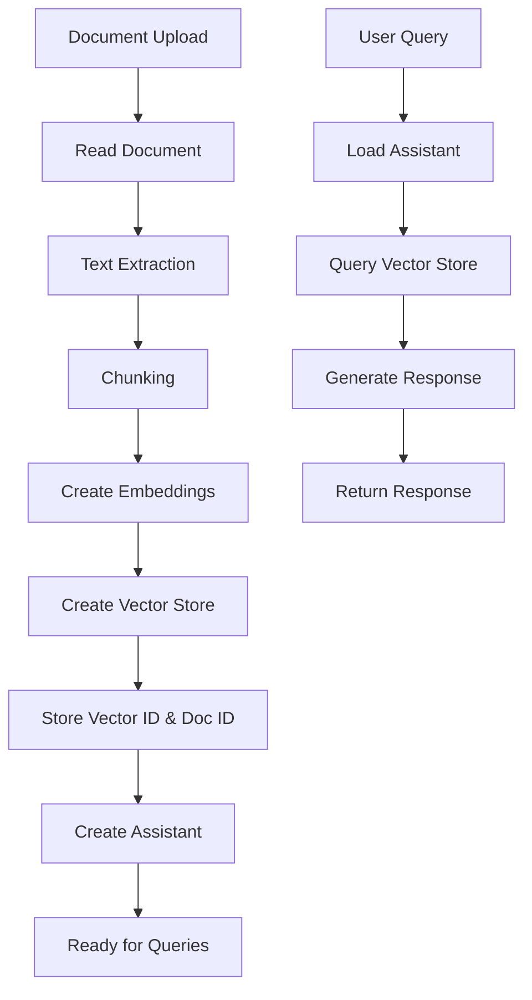

# RAG Architecture Analysis and Clean Implementation Recommendations

## Executive Summary

After analyzing the current RAG workflow implementation, I've identified multiple overlapping services, redundant implementations, and complex architecture that is causing "Create Vector Store" failures. This document provides a comprehensive analysis and recommends a clean, single-responsibility architecture.

## Current RAG Implementation Analysis

### 1. **RAG-Related Files Inventory**

#### Backend Services (`backend/app/services/`)
1. **`rag_core.py`** (950 lines) - Core RAG utilities with OpenAI integration
2. **`rag_integration.py`** (628 lines) - Direct RAG integration layer
3. **`rag_service.py`** (951 lines) - Unified RAG service with modern embeddings
4. **`rag_workflow.py`** (434 lines) - RAG workflow orchestrator
5. **`enhanced_rag_service.py`** (903 lines) - Enhanced RAG with hybrid search
6. **`simplified_rag.py`** (216 lines) - Simplified OpenAI native implementation
7. **`rag_models.py`** (194 lines) - Pydantic models for RAG
8. **`rag_client.py`** - RAG client (referenced but not analyzed)

#### Backend APIs (`backend/app/api/`)
1. **`rag.py`** (554 lines) - RAG system APIs
2. **`enhanced_rag.py`** - Enhanced RAG API endpoints
3. **`simplified_rag.py`** - Simplified RAG API endpoints

#### Frontend API Routes (`app/api/`)
1. **`process-knowledge/route.ts`** (582 lines) - Frontend knowledge processing

### 2. **Overlapping Functionality Analysis**

#### Redundant Implementations:
- **3 different RAG services** (`rag_service.py`, `enhanced_rag_service.py`, `simplified_rag.py`)
- **2 integration layers** (`rag_integration.py`, `rag_core.py`)
- **Multiple API endpoints** for similar functionality
- **Conflicting approaches** (OpenAI native vs custom embeddings)

#### Complexity Issues:
- **Mixed responsibilities** - single files handling multiple concerns
- **Circular dependencies** between services
- **Inconsistent error handling** across implementations
- **Database operations scattered** across multiple files

### 3. **Root Cause of Vector Store Creation Failure**

Based on the code analysis, the "Create Vector Store" failure is likely caused by:

#### A. **Multiple Competing Implementations**
```python
# rag_core.py - Uses OpenAI Assistant API approach
async def create_vector_store(client: OpenAI, vector_name: str, ...):
    vector_store = client.vector_stores.create(name=vector_name)

# rag_service.py - Uses custom embedding approach  
class RAGService:
    def __init__(self):
        self._embeddings_store: Dict[str, List[RAGChunk]] = {}

# enhanced_rag_service.py - Uses hybrid approach
async def _store_in_openai_vector_store(self, clone_id: str, ...):
    # Calls rag_integration which calls rag_core - circular!
```

#### B. **Configuration Conflicts**
- Multiple services trying to initialize OpenAI clients
- Inconsistent API key validation
- Database connection issues across services

#### C. **Race Conditions**
- Multiple services trying to create vector stores simultaneously
- Async operations without proper coordination
- Database transaction conflicts

### 4. **Database Structure Issues**

#### Table Relationships:
```sql
-- Current tables involved in RAG:
assistants          -- OpenAI assistant tracking
documents          -- RAG documents  
domains           -- RAG domains
experts           -- RAG experts  
vector_stores     -- Vector store metadata
knowledge         -- Clone knowledge entries
```

#### Problems:
- **Fragmented data** across multiple tables
- **Inconsistent foreign key relationships**
- **Missing indexes** for vector operations
- **No proper vector store lifecycle management**

## Recommended Clean Architecture

### 1. **Single Responsibility Principle**

#### Recommended File Structure:
```
backend/app/services/
├── rag/
│   ├── __init__.py
│   ├── core_service.py      # Single RAG service
│   ├── models.py           # All RAG models
│   ├── exceptions.py       # RAG-specific exceptions
│   └── database.py         # RAG database operations
│
└── rag_legacy/             # Move existing files here
    ├── rag_core.py
    ├── rag_integration.py
    └── ... (other files)
```

### 2. **Clean RAG Service Implementation**

#### Core Service (`core_service.py`):
```python
class CleanRAGService:
    """Single, clean RAG implementation"""
    
    def __init__(self):
        self.client = None
        self.supabase = None
        self.state = "uninitialized"
    
    async def initialize(self) -> bool:
        """Initialize service with proper error handling"""
        pass
    
    async def process_clone_documents(
        self, 
        clone_id: str, 
        documents: Dict[str, str]
    ) -> ProcessingResult:
        """Main document processing workflow"""
        pass
    
    async def query_clone(
        self, 
        clone_id: str, 
        query: str
    ) -> QueryResult:
        """Main query workflow"""
        pass
```

#### Database Operations (`database.py`):
```python
class RAGDatabase:
    """Centralized RAG database operations"""
    
    async def create_clone_vector_store(self, clone_id: str) -> str:
        """Create and track vector store for clone"""
        pass
    
    async def store_clone_embeddings(self, clone_id: str, chunks: List[Chunk]):
        """Store embeddings for clone"""
        pass
    
    async def get_clone_assistant(self, clone_id: str) -> Optional[str]:
        """Get assistant ID for clone"""
        pass
```

### 3. **Expected Clean Workflow**



### 4. **Simplified Database Schema**

#### Recommended Tables:
```sql
-- Single table for clone RAG data
CREATE TABLE clone_rag_data (
    id UUID PRIMARY KEY DEFAULT gen_random_uuid(),
    clone_id UUID REFERENCES clones(id) ON DELETE CASCADE,
    
    -- Vector store info
    vector_store_id TEXT,
    assistant_id TEXT,
    
    -- Processing status
    status TEXT DEFAULT 'pending',
    documents_processed INTEGER DEFAULT 0,
    total_documents INTEGER DEFAULT 0,
    
    -- Metadata
    processing_started_at TIMESTAMP,
    processing_completed_at TIMESTAMP,
    last_error TEXT,
    
    created_at TIMESTAMP DEFAULT NOW(),
    updated_at TIMESTAMP DEFAULT NOW()
);

-- Document chunks (if needed for custom search)
CREATE TABLE clone_document_chunks (
    id UUID PRIMARY KEY DEFAULT gen_random_uuid(),
    clone_id UUID REFERENCES clones(id) ON DELETE CASCADE,
    
    document_name TEXT NOT NULL,
    chunk_index INTEGER NOT NULL,
    chunk_content TEXT NOT NULL,
    
    -- Vector embedding (optional)
    embedding vector(1536),
    
    created_at TIMESTAMP DEFAULT NOW()
);
```

## Implementation Strategy

### Phase 1: **Isolate Current Implementation**
1. Move all existing RAG files to `rag_legacy/` folder
2. Update imports to use legacy folder
3. Ensure current functionality still works

### Phase 2: **Implement Clean Service**
1. Create new `rag/core_service.py` with single responsibility
2. Implement basic document processing workflow
3. Add proper error handling and logging

### Phase 3: **Database Migration**
1. Create new simplified tables
2. Migrate existing data to new schema
3. Update API endpoints to use new service

### Phase 4: **Testing and Validation**
1. Create comprehensive tests for new service
2. Test vector store creation workflow
3. Validate query functionality

### Phase 5: **Cleanup**
1. Remove legacy files
2. Update documentation
3. Optimize performance

## Immediate Fixes for Vector Store Failure

### Quick Fix (1-2 hours):
```python
# Create a simple wrapper that ensures single initialization
class SingletonRAGService:
    _instance = None
    _initialized = False
    
    def __new__(cls):
        if cls._instance is None:
            cls._instance = super().__new__(cls)
        return cls._instance
    
    async def ensure_initialized(self):
        if not self._initialized:
            # Initialize once
            self.client = get_openai_client()
            self.supabase = get_service_supabase()
            self._initialized = True
        return self
```

### Medium Fix (1-2 days):
1. Choose ONE implementation (recommend `rag_integration.py`)
2. Update all APIs to use only this implementation
3. Disable other RAG services temporarily

### Complete Fix (1 week):
Implement the full clean architecture described above.

## Technology Recommendations

### Recommended Stack:
- **OpenAI Assistant API** for RAG (native support)
- **Supabase pgvector** for custom embeddings (if needed)
- **Single FastAPI service** for RAG operations
- **Async/await** for all operations
- **Comprehensive logging** for debugging

### Avoid:
- Multiple competing RAG implementations
- Complex inheritance hierarchies
- Circular dependencies
- Mixed sync/async code

## Monitoring and Debugging

### Add Logging:
```python
import structlog

logger = structlog.get_logger("rag_service")

async def create_vector_store(clone_id: str):
    logger.info("Creating vector store", clone_id=clone_id)
    try:
        # Implementation
        logger.info("Vector store created", clone_id=clone_id, vector_id=vector_id)
    except Exception as e:
        logger.error("Vector store creation failed", clone_id=clone_id, error=str(e))
        raise
```

### Health Checks:
```python
async def health_check() -> Dict[str, Any]:
    return {
        "openai_client": bool(self.client),
        "supabase_client": bool(self.supabase),
        "vector_stores_created": await self.count_vector_stores(),
        "last_successful_processing": await self.get_last_success_time()
    }
```

## Next Steps

1. **Immediate**: Implement singleton pattern to fix current failures
2. **Short-term**: Choose single implementation and disable others  
3. **Medium-term**: Implement clean architecture
4. **Long-term**: Add advanced features (hybrid search, analytics)

## Conclusion

The current RAG implementation suffers from architectural complexity and competing implementations. The recommended clean architecture will:

- **Fix vector store creation failures**
- **Improve maintainability** 
- **Enable easier debugging**
- **Support future enhancements**
- **Reduce technical debt**

The single responsibility approach with proper error handling and monitoring will ensure reliable RAG functionality for the CloneAI platform.