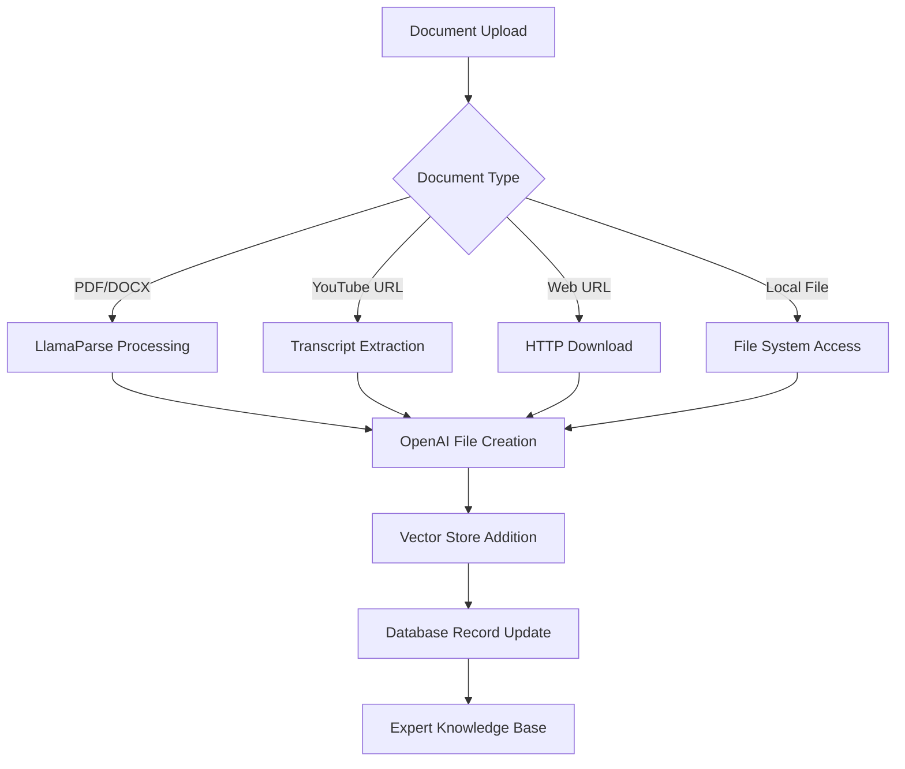
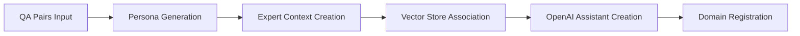
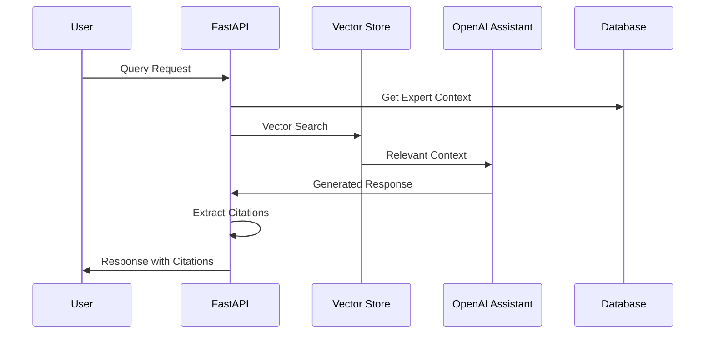
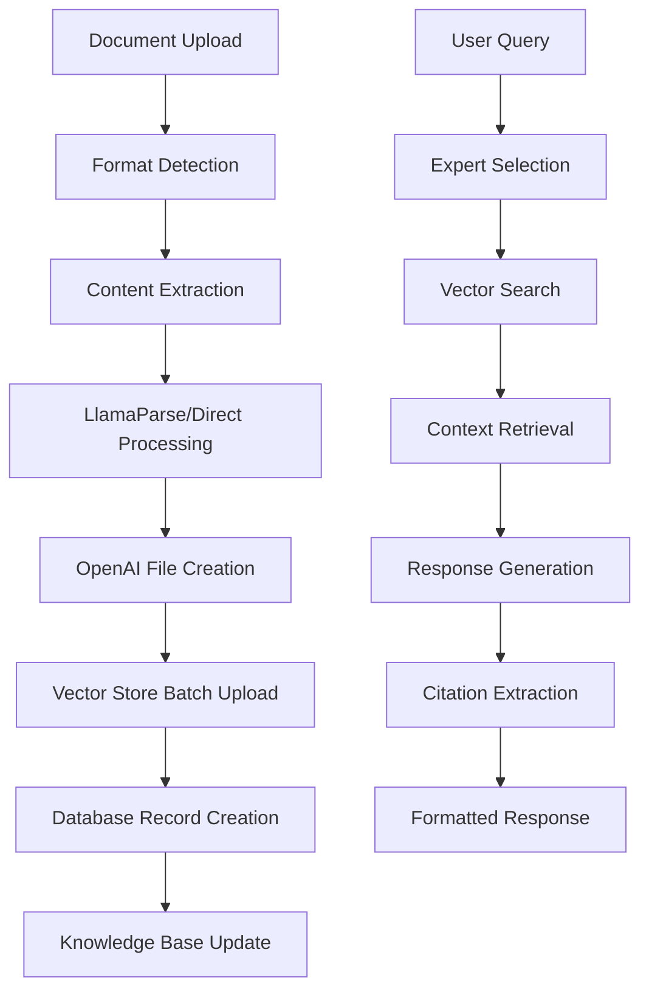

# RAG System Comprehensive Analysis: Core Working Principles and Components

## Executive Summary

The system implements a dual-architecture RAG (Retrieval Augmented Generation) solution consisting of:
1. **Standalone RAG Service** (`/rag/` directory) - A complete expert knowledge system
2. **Integrated RAG Features** - Document processing integrated into the main CloneAI application

## 1. Core Components Deep Dive

### 1.1 Standalone RAG Service Architecture

#### **Main Application Layer** (`/rag/src/api/main.py`)
```python
- FastAPI framework with CORS middleware
- Port: 8000 (standalone)
- OpenAPI documentation auto-generation
- Router prefix: /api
- Environment-based configuration
```

#### **Data Models Layer** (`/rag/src/api/models.py`)
**Core Entity Models:**
- `Expert`: Domain expert with context and specialization
- `Domain`: Knowledge domain with associated experts  
- `QueryRequest/Response`: Query processing with citation support
- `Citation`: Source attribution with quotes and references

**Vector Store Models:**
- `ExpertVectorCreate/Update`: Expert-specific knowledge bases
- `DomainVectorCreate/Update`: Domain-wide knowledge sharing
- `ClientVectorCreate`: Client-specific personalized knowledge

**OpenAI Integration Models:**
- `CreateAssistantRequest/Response`: Assistant API integration
- `CreateThreadRequest/Response`: Conversation thread management
- `RunThreadRequest/Response`: Assistant execution workflow

#### **Database Schema** (`/rag/src/db/schema.sql`)
```sql
-- Core Tables
domains(id, domain_name, expert_names[])
experts(id, name, domain, context)
documents(id, name, document_link, openai_file_id, domain, client_name)
vector_stores(id, vector_id, domain_name, expert_name, client_name, file_ids[], owner)
assistants(id, assistant_id, expert_name, memory_type, vector_id)
```

### 1.2 Integration Components in Main Application

#### **Chat Service Integration** (`/backend/app/services/chat_service.py`)
- WebSocket-based real-time communication
- Connection management for multiple users
- Message streaming with typing indicators
- RAG-enhanced response generation

#### **Document Processing** (Supabase Schema)
```typescript
knowledge: {
  clone_id, content_type, file_name, file_size_bytes,
  processing_status, created_at, updated_at
}

clones: {
  document_processing_status, expertise_areas,
  system_prompt, personality_traits
}
```

## 2. Working Principles Analysis

### 2.1 Document Ingestion and Processing Flow



**Key Processing Components:**
- **LlamaParse Integration**: Converts documents to structured markdown
- **YouTube Transcript API**: Extracts video transcripts with timestamps
- **Multi-format Support**: PDF, DOCX, TXT, images, web URLs
- **OpenAI File API**: Secure file storage and processing

### 2.2 Expert Generation Process



**Expert Creation Workflow:**
1. **Domain Assignment**: Expert linked to knowledge domain
2. **Context Definition**: Specialized instructions and personality
3. **Memory Type Selection**: LLM, Domain, Expert, or Client memory
4. **Vector Store Creation**: Dedicated knowledge base
5. **Assistant API Integration**: OpenAI assistant with vector store access

### 2.3 Query/Response Mechanism



**Query Processing Steps:**
1. **Expert Selection**: Route to appropriate domain expert
2. **Memory Type Resolution**: Determine knowledge source (domain/expert/client)
3. **Vector Search**: Retrieve relevant document chunks
4. **Context Assembly**: Combine expert context + retrieved knowledge
5. **Response Generation**: OpenAI generation with source attribution
6. **Citation Extraction**: Link responses to source documents

### 2.4 Citation and Context Handling

**Citation System Architecture:**
```python
class Citation(BaseModel):
    quote: str      # Exact text from source
    source: str     # Document reference
```

**Context Management Hierarchy:**
1. **LLM Memory**: Direct GPT-4 without knowledge base
2. **Domain Memory**: Shared domain knowledge
3. **Expert Memory**: Specialized expert knowledge
4. **Client Memory**: Personalized client knowledge

### 2.5 Memory Management System

**Vector Store Hierarchy:**
- **Domain Default**: `Default_{domain_name}` - Shared knowledge
- **Expert Specific**: `{expert_name}_{domain_name}` - Expert specialization
- **Client Specific**: `{expert_name}_{client_name}` - Personalized knowledge

**Memory Operations:**
- **Initialize**: Create complete expert memory with QA pairs and documents
- **Update**: Add/remove documents from vector stores
- **Append**: Add new knowledge without replacing existing
- **Replace**: Complete knowledge base replacement

## 3. Data Flow Analysis

### 3.1 Document Upload → Processing → Storage → Retrieval Flow



### 3.2 User Query → Vector Search → Response Generation Flow

**Query Processing Pipeline:**
1. **Input Validation**: Query structure and expert availability
2. **Memory Type Resolution**: Determine knowledge source
3. **Vector Store Query**: Semantic search for relevant content
4. **Context Assembly**: Combine expert prompt + retrieved documents
5. **OpenAI Processing**: Generate response with assistant API
6. **Citation Parsing**: Extract source references
7. **Response Formatting**: Structure final output

### 3.3 Expert Creation and Knowledge Base Building Process

**Expert Initialization Workflow:**
```python
# 1. Domain Creation/Verification
domain = create_domain(domain_name)

# 2. Expert Registration
expert = create_expert(name, domain, context)

# 3. Vector Store Creation
vector_store = create_expert_vector(expert_name, domain_name)

# 4. Document Processing
for doc_url in document_urls:
    file_id = create_file_for_vector_store(doc_url)
    add_to_vector_store(vector_store, file_id)

# 5. Assistant Creation
assistant = create_assistant(expert_name, vector_store_id)

# 6. Persona Generation (Optional)
persona = generate_persona_from_qa(qa_pairs)
update_expert_context(expert_name, persona)
```

## 4. Key Files Analysis

### 4.1 `/rag/src/api/main.py` - Main FastAPI Application
**Purpose**: Entry point for standalone RAG service
**Key Features**:
- CORS configuration for cross-origin requests
- Router inclusion with `/api` prefix
- Environment variable loading
- Auto-generated OpenAPI documentation

### 4.2 `/rag/src/api/endpoints.py` - API Route Definitions
**Purpose**: Complete API endpoint implementation
**Key Endpoints**:
- Domain management (create, list, get)
- Expert management (create, update, query)
- Vector store operations (create, update, delete)
- Document processing (upload, update, manage)
- OpenAI Assistant integration (create, run, query)

### 4.3 `/rag/src/api/utils.py` - Core Service Functions
**Purpose**: Utility functions for OpenAI and document processing
**Key Functions**:
- `create_vector_store()`: OpenAI vector store creation
- `create_file_for_vector_store()`: Document processing and file creation
- `query_vector_index()`: Vector search operations
- `create_assistant()`: OpenAI Assistant API integration
- `get_youtube_transcript()`: YouTube video transcript extraction

### 4.4 `/rag/src/api/models.py` - Data Models
**Purpose**: Pydantic models for request/response validation
**Key Models**:
- Expert and Domain management models
- Vector store operation models
- Query and response models with citation support
- OpenAI Assistant API integration models

### 4.5 `/rag/src/db/schema.sql` - Database Schema
**Purpose**: Complete database structure definition
**Key Features**:
- Domain and expert relationship management
- Document tracking with OpenAI file IDs
- Vector store metadata and file associations
- Assistant tracking for OpenAI integration

## 5. Technical Architecture

### 5.1 OpenAI Assistant API Integration

**Integration Pattern:**
```python
# Assistant Creation
assistant = client.assistants.create(
    model="gpt-4o",
    name=f"{expert_name} Assistant",
    instructions=expert_context,
    tools=[{"type": "file_search"}],
    tool_resources={
        "file_search": {
            "vector_store_ids": [vector_store_id]
        }
    }
)

# Query Processing
thread = client.threads.create()
client.threads.messages.create(
    thread_id=thread.id,
    role="user",
    content=query
)
run = client.threads.runs.create_and_poll(
    thread_id=thread.id,
    assistant_id=assistant.id
)
```

### 5.2 Vector Store Management

**Hierarchical Knowledge Organization:**
- **Domain Level**: Shared knowledge across all experts in domain
- **Expert Level**: Specialized knowledge for specific expert
- **Client Level**: Personalized knowledge for individual clients

**Vector Store Operations:**
- **Create**: Initialize new vector store with unique naming
- **Update**: Add/remove documents with batch processing
- **Query**: Semantic search with relevance scoring
- **Delete**: Clean removal with dependency tracking

### 5.3 Document Parsing and Chunking Strategy

**LlamaParse Integration:**
```python
llama_parser = LlamaParse(
    api_key=LLAMAPARSE_API_KEY,
    num_workers=4,
    verbose=True,
    language="en"
)
```

**Document Processing Strategy:**
1. **Format Detection**: Automatic file type identification
2. **Content Extraction**: LlamaParse for complex documents
3. **Chunking**: OpenAI handles optimal chunk sizing
4. **Embedding**: Automatic vector generation
5. **Storage**: Secure file storage in OpenAI

### 5.4 Citation System Implementation

**Citation Extraction Process:**
```python
def extract_citations(response_text: str, source_documents: List[str]) -> List[Citation]:
    # Parse response for source references
    # Match quotes to source documents
    # Return structured citation objects
```

**Citation Display:**
- **Quote**: Exact text from source document
- **Source**: Document name and reference
- **Context**: Surrounding text for verification

## 6. Key Technical Insights

### 6.1 Memory Type System
The system implements a sophisticated memory hierarchy allowing different levels of knowledge access:
- **LLM**: No vector search, pure language model responses
- **Domain**: Access to domain-wide knowledge base
- **Expert**: Access to expert-specific knowledge
- **Client**: Access to personalized client knowledge

### 6.2 Async Processing Architecture
- FastAPI async endpoints for concurrent request handling
- Async document processing with batch uploads
- Non-blocking vector store operations
- Streaming response capabilities

### 6.3 Error Handling and Resilience
- Comprehensive exception handling throughout the pipeline
- Fallback mechanisms for document processing failures
- Retry logic for external API calls
- Graceful degradation for unavailable services

### 6.4 Scalability Considerations
- **Batch Processing**: Efficient document uploads
- **Vector Store Isolation**: Separate knowledge bases per client
- **Async Operations**: Non-blocking request processing
- **Connection Pooling**: Efficient database connections

## 7. Integration Points

### 7.1 Supabase Integration
- **Database**: PostgreSQL with advanced array operations
- **Storage**: Document file storage capabilities
- **Authentication**: Row Level Security for multi-tenancy
- **Real-time**: WebSocket support for live updates

### 7.2 OpenAI Services Integration
- **Assistant API**: Complete assistant lifecycle management
- **Vector Stores**: Managed embedding and search
- **File API**: Secure document storage and processing
- **Models**: GPT-4o for generation, embedding models for vectors

### 7.3 External Service Dependencies
- **LlamaParse**: Advanced document parsing
- **YouTube API**: Video transcript extraction
- **HTTP Services**: Web document retrieval
- **File System**: Local document processing

## Conclusion

The RAG system represents a sophisticated knowledge management and retrieval architecture that combines:

1. **Dual Architecture**: Standalone service + integrated features
2. **Hierarchical Knowledge**: Domain → Expert → Client specialization
3. **Advanced Document Processing**: Multi-format support with intelligent parsing
4. **Real-time Capabilities**: WebSocket-based chat with streaming
5. **Citation System**: Complete source attribution and verification
6. **Scalable Design**: Async processing with efficient resource management

The system effectively bridges the gap between raw documents and intelligent, contextual responses while maintaining source attribution and supporting multiple knowledge hierarchies for different use cases.