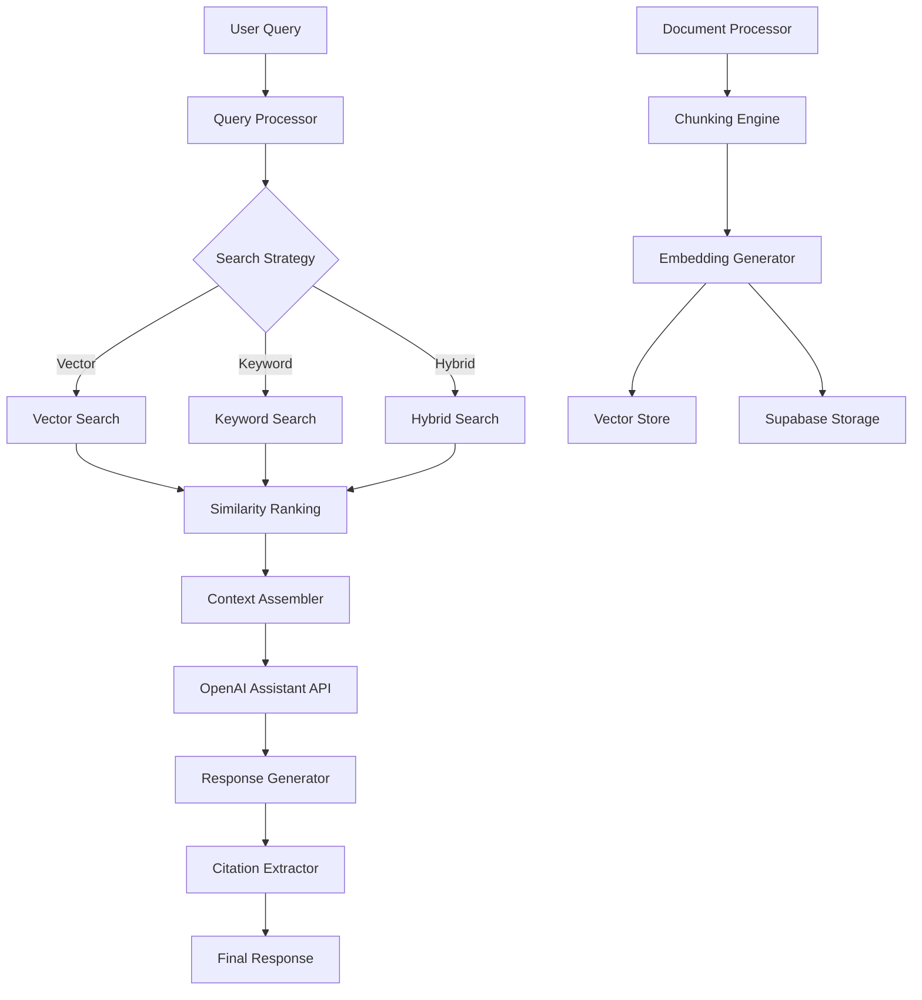

# Enhanced RAG Implementation Plan

## Overview
This document outlines the enhanced RAG implementation that improves upon your existing OpenAI Assistant-based approach with fine-grained control and hybrid search capabilities.

## Architecture Overview

## Implementation Steps

### Phase 1: Enhanced Document Processing
1. **Semantic Chunking**: Improve upon simple text splitting
2. **Dual Storage**: Store embeddings in both OpenAI and Supabase
3. **Metadata Tracking**: Track chunk-level metadata and relationships

### Phase 2: Advanced Query Processing
1. **Query Rewriting**: Transform user queries for better retrieval
2. **Multi-Modal Search**: Vector + keyword + hybrid search
3. **Search Analytics**: Track query performance and results

### Phase 3: Intelligent Context Assembly
1. **Dynamic Context Selection**: Choose optimal chunks based on relevance
2. **Token Management**: Respect context window limits
3. **Citation Generation**: Automatic source attribution

### Phase 4: Hybrid Search Implementation
1. **Vector Search**: Semantic similarity using embeddings
2. **Keyword Search**: Traditional full-text search
3. **Hybrid Ranking**: Combine and rank results from both approaches

## Key Features

### 1. Enhanced Document Processing
- **Semantic Chunking**: Split documents at sentence/paragraph boundaries
- **Overlap Strategy**: Include overlapping text between chunks for context
- **Metadata Extraction**: Extract and store document metadata
- **Dual Storage**: Store in both OpenAI vector stores and Supabase

### 2. Advanced Query Processing
- **Query Analysis**: Understand query intent and type
- **Query Expansion**: Add related terms for better matching
- **Search Strategy Selection**: Choose optimal search approach
- **Performance Tracking**: Monitor search effectiveness

### 3. Intelligent Retrieval
- **Multi-Strategy Search**: Vector, keyword, and hybrid approaches
- **Relevance Scoring**: Advanced ranking algorithms
- **Context Optimization**: Select optimal content for responses
- **Citation Tracking**: Maintain source-to-response mappings

### 4. Fine-Grained Control
- **Search Parameter Tuning**: Adjust similarity thresholds, top-k values
- **Context Window Management**: Optimize for different model limits
- **Performance Monitoring**: Track response times and accuracy
- **A/B Testing Support**: Compare different RAG strategies

## Benefits Over Current Implementation

1. **Better Retrieval**: Hybrid search finds more relevant documents
2. **Improved Citations**: Better source attribution and tracking
3. **Performance Monitoring**: Detailed analytics on RAG effectiveness
4. **Flexibility**: Multiple search strategies for different query types
5. **Scalability**: Optimized for larger document collections
6. **User Experience**: Faster responses with better accuracy

## Next Steps

1. **Review and Approve**: Confirm this approach meets your requirements
2. **Implementation**: Proceed with the enhanced RAG service
3. **Testing**: Validate improvements over current system
4. **Integration**: Update existing APIs to use enhanced features
5. **Monitoring**: Set up analytics and performance tracking

## Questions for Consideration

1. Do you want to maintain backward compatibility with existing RAG APIs?
2. Should we implement gradual migration or full replacement?
3. What priority should we give to each search strategy (vector/keyword/hybrid)?
4. Do you need real-time analytics or batch processing for performance monitoring?